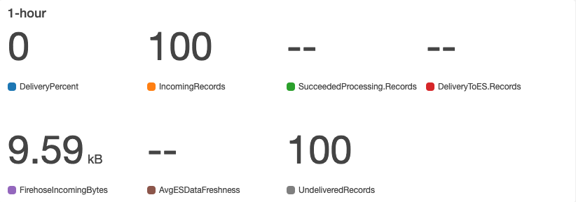
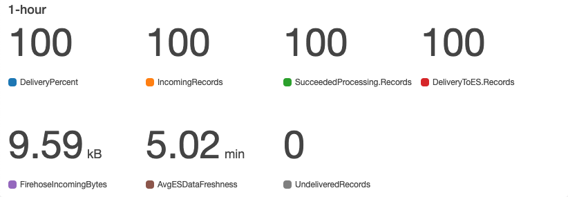
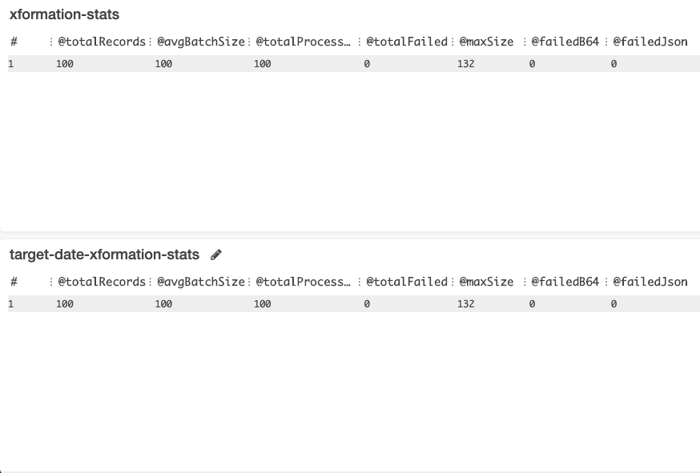
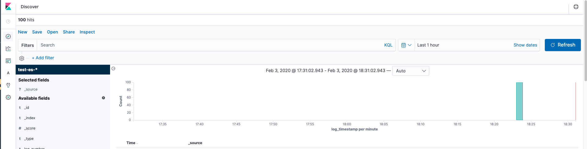

# terraform-aws-firehose-elasticsearch

Terraform module for setting up AWS Firehose with Elasticsearch as destination. Works with Terraform >= 0.12.

## Why?

This module builds on top of existing Terraform modules - [AWS Kinesis Firehose](https://www.terraform.io/docs/providers/aws/r/kinesis_firehose_delivery_stream.html),
[AWS Elasticsearch](https://www.terraform.io/docs/providers/aws/r/elasticsearch_domain.html) and [AWS Lambda](https://www.terraform.io/docs/providers/aws/r/lambda_function.html) -
to enable the user to build a logging pipeline with examples provided for both sender and receiver AWS accounts. It also creates AWS Cloudwatch dashboards -
a **metrics** dashboard to monitor the infra and an **insights** dashboards to get realtime information on AWS Kinesis Firehose record transformations.

## Pre-requisites

Basic knowledge of [AWS Kinesis Firehose + AWS Elasticsearch](https://docs.aws.amazon.com/elasticsearch-service/latest/developerguide/es-aws-integrations.html)

## Architecture

1. Sender AWS account has an **AWS Lambda** which send logs to the receiver AWS account - sender Lambda knows the IAM Role to assume of the receiver
   AWS account.
2. Receiver AWS account IAM role trusts the sender AWS account and accepts logs at the **AWS Kinesis Firehose**.
3. **AWS Kinesis Firehose** validates the incoming records and does any data transformation through **AWS Kinesis transformation Lambda**.
4. **AWS Kinesis Firehose** backs up a copy of the incoming records to a backup **AWS S3 bucket**.
5. Valid records are delivered to **AWS Elasticsearch**.
6. Invalid records (invalid json, invalid base64 encoding) and Elasticsearch reject records (Elasticsearch mapping exceptions, etc.)
    are backed up to **processing-failed** and **elasticsearch-failed** buckets respectively.
7. The user can view valid logs on the **AWS Elasticsearch Kibana UI**.

We will use the following Lambda code repos:

1. [aws-firehose-log-sender](https://github.com/saurabh-hirani/aws-firehose-log-sender/settings) as the sender AWS Lambda.
2. [aws-firehose-xformation-lambda](https://github.com/saurabh-hirani/aws-firehose-xformation-lambda) as the receiver AWS Kinesis transformation Lambda.

## Talk is cheap - show me the code

1. Set up the receiver AWS account as per this [example](./examples/receiver).
2. Set up the sender AWS account as per this [example](./examples/sender).
3. Send data through the [aws-firehose-log-sender](https://github.com/saurabh-hirani/aws-firehose-log-sender).
4. Monitor the **test-firehose-es-metrics** + **test-firehose-es-insights** Cloudwatch dashboards and AWS Elasticsearch Kibana UI.

## Sample dashboard screenshots after sending 100 logs

* Use [aws-firehose-log-sender](https://github.com/saurabh-hirani/aws-firehose-log-sender/settings) to send 100 logs.

* **test-firehose-es-metrics** dashboard snipped screenshot - before delivery.
    

* **test-firehose-es-metrics** dashboard snipped screenshot - after delivery.
    

* **test-firehose-es-insights** dashboard output - after delivery.
    

* AWS Kibana UI - after delivery.
    

### How to release newer versions of this module

Follow the instructions described [here](https://gist.github.com/saurabh-hirani/883445b068937f85625513adb0342b05)
